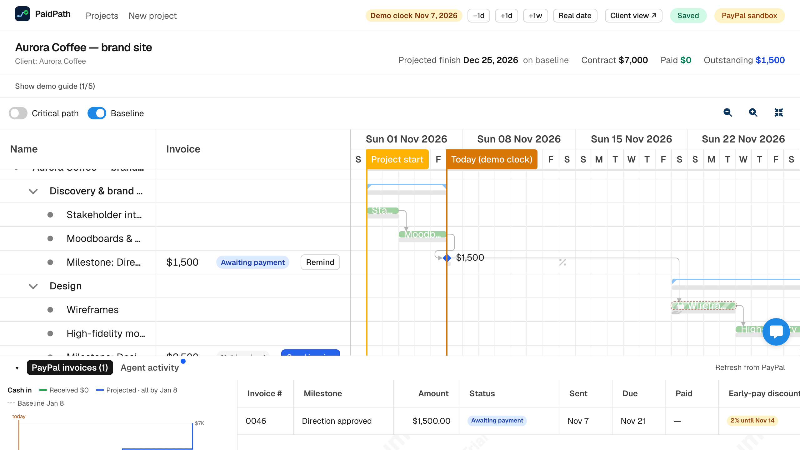
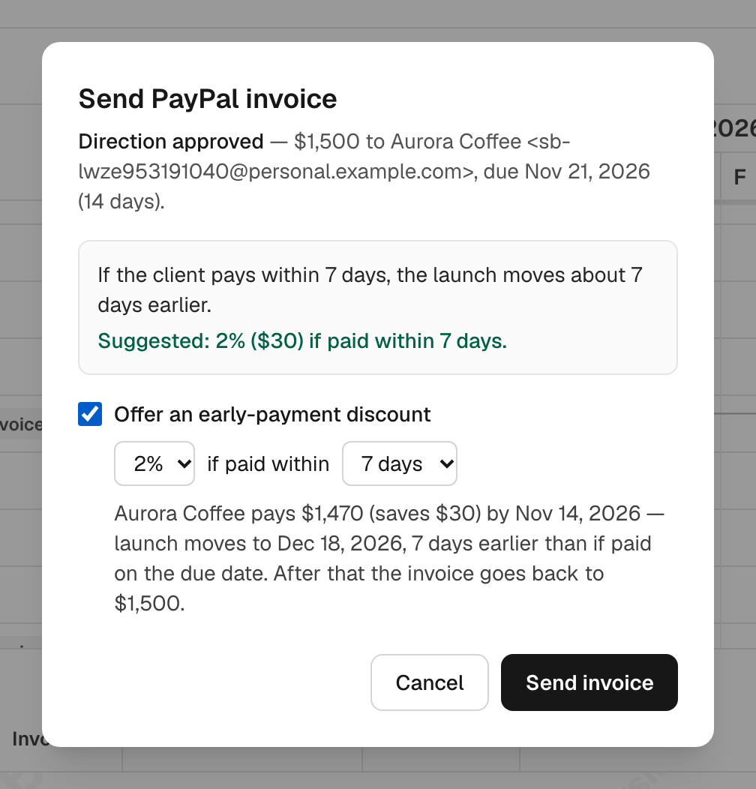
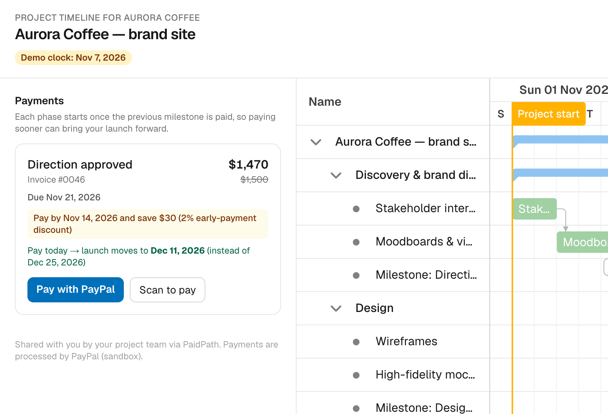
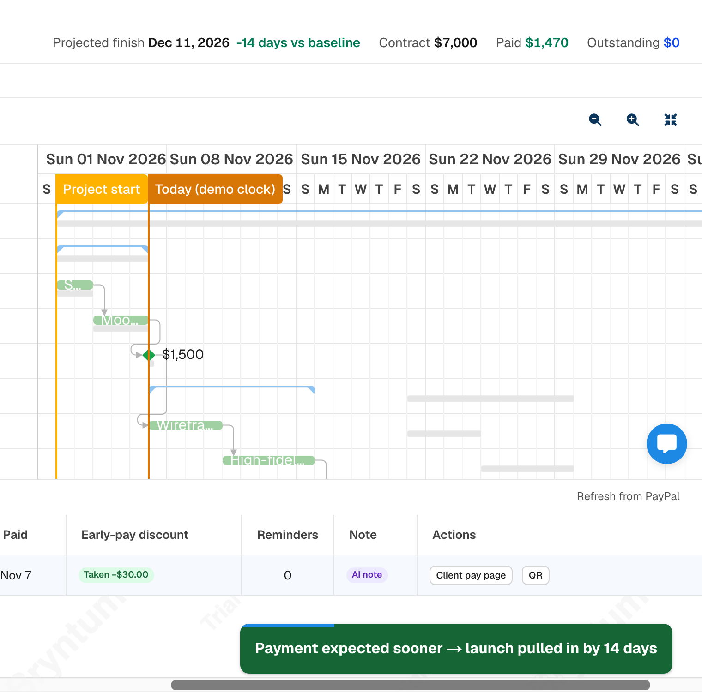
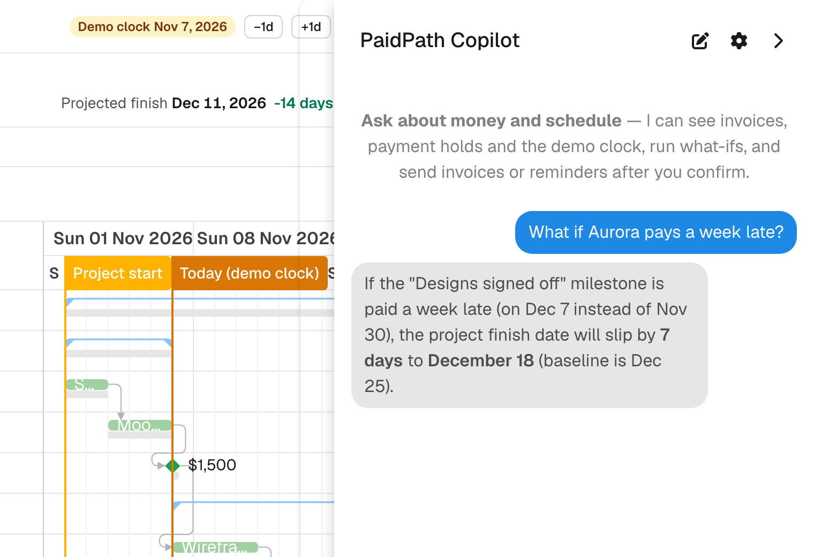
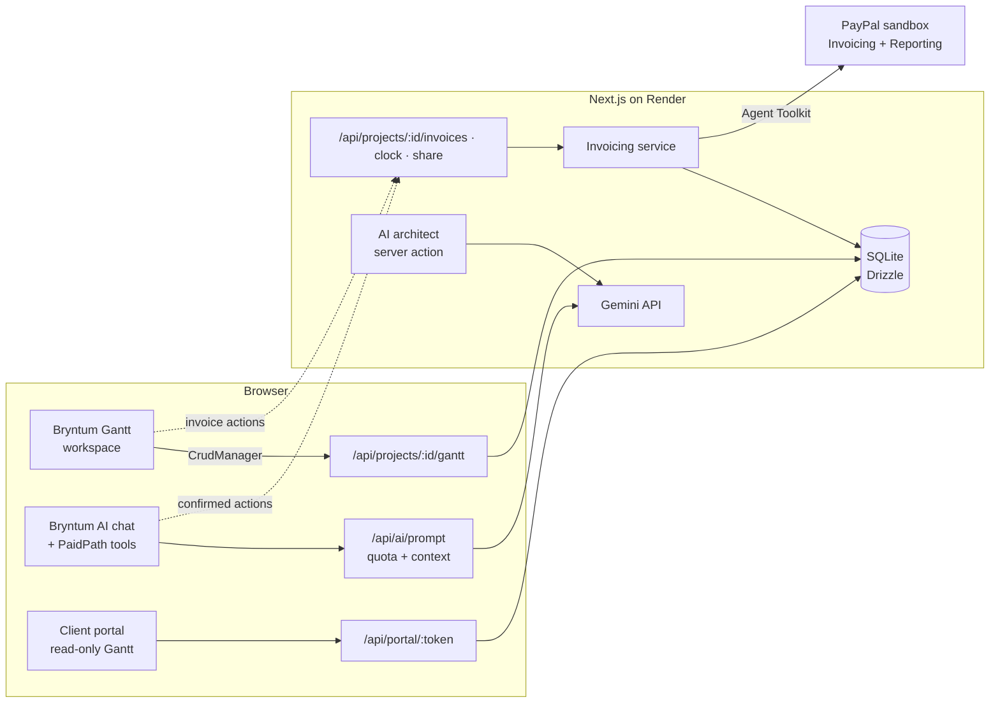

# PaidPath

**The project plan that reacts to money.**

PaidPath is an AI project-to-cash workspace for freelancers and small agencies. Describe a
project and AI drafts a priced, milestone-by-milestone plan on a
[Bryntum Gantt](https://bryntum.com/products/gantt/). Every milestone is a **PayPal invoice**
sent through the [PayPal Agent Toolkit](https://github.com/paypal/agent-toolkit). When a client
pays late, the next phase waits; when they pay early (or take your early-payment discount), the
launch moves in — on your timeline and on the client's own portal.

**Live demo:** https://paidpath.onrender.com → **Try the live demo** creates *your own* copy of a
demo project (PayPal sandbox, no sign-up). · **Video:** _coming with the submission_

> Built for the [PayPal AI Hackathon](https://paypalaihackathon.devpost.com/) (2026).



## Try it in 3 minutes

A checklist in the demo walks you through it; each step ticks off by itself.

1. **Send the first invoice.** Click **Send invoice** on *Direction approved*. PaidPath simulates the
   plan first — *"If the client pays within 7 days, the launch moves about 7 days earlier. Suggested:
   2% ($30)."* — keep the discount and send. A real PayPal sandbox invoice goes out.
2. **Open Client view** (header). This is what your client sees: their timeline, what's due with a
   PayPal pay button, the discount, and *"Pay today → launch moves to Dec 11 (instead of Dec 25)"*.
3. **Record the payment** in *PayPal invoices*. The Design phase pulls in; the launch moves 14 days
   earlier (toast, header KPI, cash chart). The portal updates within seconds.
4. **Let a payment run late.** Send the next invoice, then press **+1w** on the demo clock until it's
   overdue — the plan slips a day per day and the expired discount is removed on PayPal.
5. **Ask the copilot** (chat button, bottom right): *"What if Aurora pays a week late?"* or
   *"Chase the overdue invoice."*

The **Agent activity** tab shows every step with who did it: you, the copilot, the AI architect,
PaidPath's automation, or the client.

## Why it's different

Plenty of tools generate a project plan, and plenty send invoices. PaidPath connects the two:
**payment state is a scheduling input.** Each billable milestone holds back the work that depends
on it until the client is expected to pay (milestone date + terms → the invoice's due date →
"today" while overdue → the real payment date). Bryntum's scheduling engine reflows the plan,
so cash timing and delivery timing are one picture — for you and for your client.

## Feature tour

| | |
| --- | --- |
| **AI Plan Architect** | `/projects/new`: brief + budget + start date → Gemini structured output → normalized server-side (acyclic, bounded durations, milestone prices that sum exactly to the budget) → editable *AI draft* you can regenerate with feedback or accept. |
| **PayPal invoicing loop** | Send from the Invoice column or task menu: AI-written note (template fallback) → `create_invoice` → `send_invoice` → `get_invoice` → QR code. Milestones turn grey → blue → green; reminders escalate in tone; open invoices are polled, so a client paying on PayPal shows up live. |
| **Payment-gated dependencies** | Holds are `startnoearlierthan` constraints PaidPath owns; early payment pulls the plan in, late payment pushes it out, with baseline, critical path, a cash chart and a per-project demo clock. |
| **Early-payment discounts** | The send dialog simulates the plan on a headless copy and suggests an offer. The discount is a real line-item discount on the PayPal invoice; paying in the window settles at the discounted amount, and PaidPath removes the discount via `update_invoicing` when the window passes. |
|  |  |
| **Client portal** | A secret, rotatable, read-only link (also in every invoice note): read-only Bryntum Gantt, what's due, PayPal pay buttons + QR, discounts, and a live "pay today → launch" simulation. No write routes; merchant links, notes and emails are never exposed. |
| **Ops Copilot** | Bryntum's AI chat panel extended with PaidPath tools: what-if simulations, discount suggestions, PayPal transaction search, and confirmed actions (send/remind/record payment/move the clock); plan edits use Bryntum's inline approve + undo. |
|  |  |

## How the sponsor technologies are used

### Bryntum
| Feature | Where |
| --- | --- |
| Gantt + scheduling engine, constraints | Payment holds as `startnoearlierthan` constraints; the engine reflows dependents (`src/components/gantt/payment-gates.ts`) |
| CrudManager | Load/sync the plan to SQLite with phantom-id mapping (`/api/projects/[id]/gantt`, `src/server/gantt/crud.ts`) |
| Baselines, critical paths, indicators, time ranges, labels, task menu, task renderer, toolbar, Toast, MessageDialog | Plan vs baseline, "waiting for payment" / discount markers, demo-clock Today line, invoice actions, pull-in/slip toasts, copilot confirmations (`PlanGantt.tsx`) |
| Headless `ProjectModel` | What-if and discount simulations on a copy of the plan (`src/components/gantt/simulate.ts`) |
| AI feature (ChatPanel, `GooglePlugin`, `AIHelper` custom tools, inline approvals, undo) | Ops Copilot (`src/components/copilot/tools.ts`, proxy in `src/server/copilot/`) |
| Grid | Invoice ledger and Agent activity feed |
| Read-only Gantt | Client portal (`src/components/portal/PortalGantt.tsx`) |

### PayPal (Agent Toolkit, sandbox)
| Tool | Used for |
| --- | --- |
| `create_invoice`, `send_invoice`, `get_invoice`, `generate_invoice_qr_code` | Milestone invoices with pay link + QR |
| `send_invoice_reminder` | Reminders (tone escalates; the copilot can write the note) |
| `record_payment_for_invoice` | Sandbox "Record payment" (pays PayPal's current `due_amount`, discount-aware) |
| `update_invoicing` | Removing an early-payment discount when its window passes |
| `list_transactions` | Copilot answers about real PayPal account activity |
| `list_invoices` | AI smoke test (Gemini tool-calling through the toolkit) |

PayPal's dedicated early-payment-discount endpoint (`create_conditional_rules_for_invoice`) returned
HTTP 500 in sandbox for every combination we tried, so PaidPath uses a line-item discount and
enforces the window itself (`npm run smoke:discount` reproduces both behaviours).

### AI (Google Gemini, free tier)
| Use | Model / approach |
| --- | --- |
| Plan architect | Vercel AI SDK v6 `generateText` + `Output.object` (3.5 Flash → 3.8 Flash → Flash-Lite), template fallback |
| Invoice notes | Short client-facing note per invoice, template fallback |
| Ops Copilot | Bryntum AI → `/api/ai/prompt` proxy (key stays server-side) with a live project snapshot, so read questions take one request; Flash-Lite first (~1–4 s per request) |
| Free-tier design | Quota-aware model routing, per-visitor rate limits, in-chat "out of quota" notices, deterministic simulations and suggestions (no AI calls) |

## Architecture



## Run locally

Requirements: Node.js 22+, a free [PayPal Developer](https://developer.paypal.com/) sandbox app and a
free [Gemini API key](https://aistudio.google.com/).

PayPal sandbox setup: create a **US** sandbox business account, create a REST app owned by it and
enable the app's **Invoicing** and **Transaction search** features. Use the default sandbox
*personal* account's email as `PAYPAL_SANDBOX_BUYER_EMAIL`.

```bash
npm install
cp .env.example .env.local   # PayPal sandbox + Gemini credentials
npm run dev                  # http://localhost:3000 → "Try the live demo"
```

The SQLite database (`data/paidpath.db`) is created and migrated on first start. Locally a shared
demo project is also seeded (`npm run db:seed -- --reset` resets everything).

| Command | What it does |
| --- | --- |
| `npm run dev` / `build` / `start` | Next.js dev server / production build / production server |
| `npm test` | Unit tests (Node test runner, in-memory SQLite) |
| `npm run e2e -- [--base URL] [--copilot]` | Headless-browser smoke suite on a fresh demo copy (real PayPal sandbox; `--copilot` needs the server in `COPILOT_MODE=replay`) |
| `npm run typecheck`, `npm run lint` | Type and lint checks |
| `npm run screens` | Regenerates the screenshots in `public/screens/` |
| `npm run smoke:paypal` · `smoke:ai` · `smoke:invoice-flow` · `smoke:discount` | Real sandbox / Gemini checks |
| `npm run eval:architect` | Three sample briefs through the AI architect, checking plan invariants |
| `npm run db:seed [-- --reset]` · `db:generate` | Seed / generate a Drizzle migration |

**Deploy (Render):** `render.yaml` defines a free web service — **New → Blueprint**, connect the repo,
fill in the four secrets. The hosted instance doesn't seed a shared project; every visitor gets
their own demo copy.

## Limitations (honest notes)

- **PayPal sandbox only.** "Record payment" simulates the client paying; real buyer checkout works
  through the invoice pay page with a sandbox personal account.
- **No sign-in.** Projects are scoped to the visitor's browser cookie in lists, but a project URL is
  reachable by anyone who has it. Demo copies expire after 24 hours; Render restarts reset the
  database.
- **Gemini free tier.** The hosted demo shares a small daily quota. When it runs out, the copilot
  says so in the chat and everything else keeps working (template plans and notes). Running
  locally with your own free key avoids this.
- **Bryntum trial.** The Gantt shows the trial watermark; Bryntum is installed from its public npm
  trial package and isn't redistributed here.
- **Demo clock.** Time-dependent behaviour (due dates, overdue, discount windows) follows a
  per-project simulated date; dates sent to PayPal stay real.

## Stack

Next.js 16 (App Router, TypeScript) · Tailwind CSS · Bryntum Gantt 7.3 · SQLite (better-sqlite3) +
Drizzle ORM · PayPal Agent Toolkit · Vercel AI SDK v6 · Google Gemini · Render

## License

MIT for this repository's code. Bryntum Gantt is commercial software installed from Bryntum's public
npm trial package and is not redistributed here.
